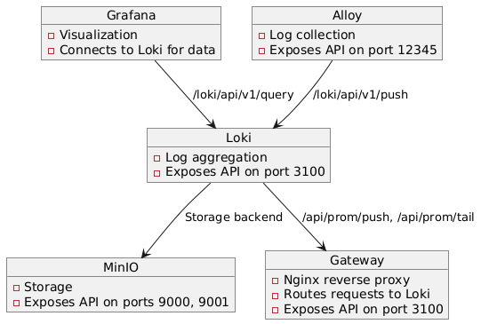

### This docker compose file is used to setup a distributed logging system .
Technologies used in this setup are:

* Docker-compose
* Grafana(For visualization)
* Loki(For log aggregation)
* Alloy(For log collection)
* MinIO(For storage)

## Architecture

* Goto - grafana dashboard - http://localhost:3000
* Select Explore and select Loki as datasource and query logs.